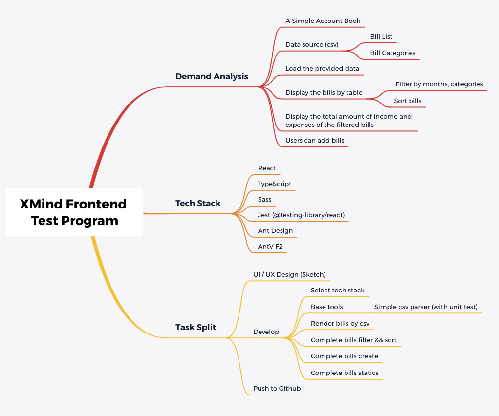
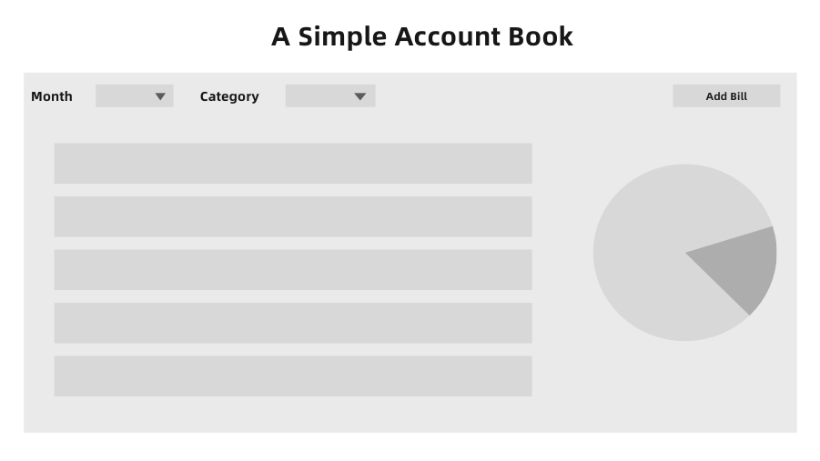
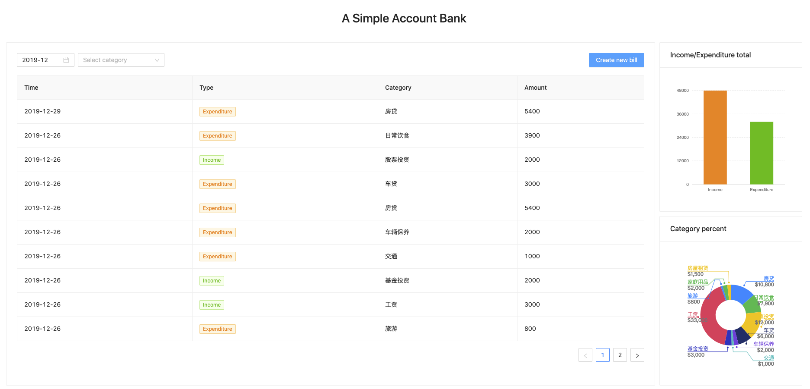
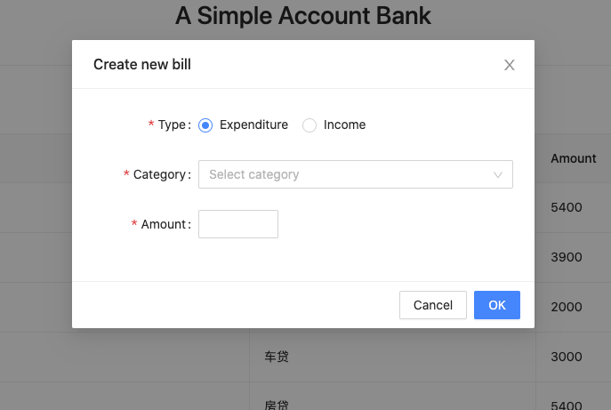

# XMind Frontend Test Program

> Follow this link to know more about the test Program: https://github.com/xmindltd/hiring/tree/master/frontend-1

Here is how I completed the test program.

## Demand Analysis

A simple account bank.

### Data analysis.

There are two data source csv.

#### bills.csv

Fields: type, time, category, amount.

- type: store bill type, 0 is expenditure, 1 is income.
- time: store bill create timestamp.
- category: store category id.
- amount: store bill amount.

#### categories.csv

Fields: id, type, name.

- id: store category id.
- type: store category bill type, 0 is expenditure, 1 is income.
- name: store the category name

### Main demands

- Display the bills by table from two source data csv files.
  - Support filter, sort.
  - Support statistics.
- Create bills.

## Tech Stack

For the good experience and elegant programming.

- React(TypeScript)
- Scss
- Jest(@testing-library/react)
- Ant Design
- AntV F2

## Work Flow

- [x] UI/UX Design(Sketch)
- [x] Develop
  - [x] Base tools: SimpleCSVParser(with unit test).
  - [x] Render bills by csv.
  - [x] Complete bills filter, sort.
  - [x] Complete bills create.
  - [x] Complete bills statics
- [x] Push to Github

### UI/UX Design (basic)

## Screen Shoots

